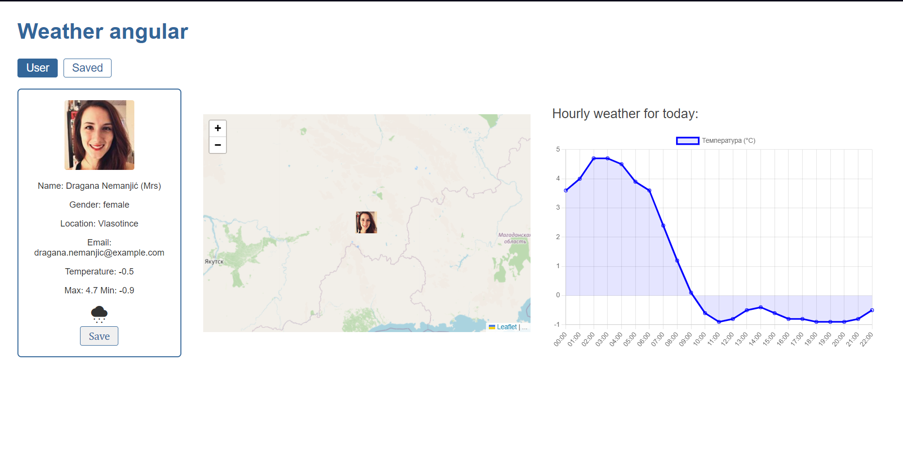

# Weather app 🌦 ☁ 🌤 ☀

### Сheck out the [live page](https://weather-angular-self.vercel.app/user)

 
Created with Angular
<svg xmlns="http://www.w3.org/2000/svg" x="0px" y="0px" width="30" height="30" viewBox="0 0 48 48">
<path fill="#bdbdbd" d="M23.933 2L3 9.285 6.308 36.408 23.955 46 41.693 36.278 45 9.156z"></path><path fill="#b71c1c" d="M42.818 10.527L24 4.135 24 43.695 39.832 35.017z"></path><path fill="#dd2c00" d="M23.941 4.115L5.181 10.644 8.168 35.143 23.951 43.721 24 43.695 24 4.135z"></path><path fill="#bdbdbd" d="M24 5.996L24 15.504 32.578 34 36.987 34z"></path><path fill="#eee" d="M11.013 34L15.422 34 24 15.504 24 5.996z"></path><path fill="#bdbdbd" d="M24 24H30V28H24z"></path><path fill="#eee" d="M18 24H24V28H18z"></path>
</svg>
Typescript 
<svg xmlns="http://www.w3.org/2000/svg" x="0px" y="0px" width="34" height="34" viewBox="0 0 48 48">
<rect width="36" height="36" x="6" y="6" fill="#1976d2"></rect><polygon fill="#fff" points="27.49,22 14.227,22 14.227,25.264 18.984,25.264 18.984,40 22.753,40 22.753,25.264 27.49,25.264"></polygon><path fill="#fff" d="M39.194,26.084c0,0-1.787-1.192-3.807-1.192s-2.747,0.96-2.747,1.986 c0,2.648,7.381,2.383,7.381,7.712c0,8.209-11.254,4.568-11.254,4.568V35.22c0,0,2.152,1.622,4.733,1.622s2.483-1.688,2.483-1.92 c0-2.449-7.315-2.449-7.315-7.878c0-7.381,10.658-4.469,10.658-4.469L39.194,26.084z"></path>
</svg>
ngx-leaflet and Chart.js

### User page

### Saved users page

The source from which the data was obtained:

1. User details: - https://randomuser.me/api/
2. Weather: [https://open-meteo.com/en/docs ](https://open-meteo.com/en/docs)

Each user card has a save button that saves the data to the browser's local storage.
Saved users page -list of saved user information.

Bonus features

- Update current temperature periodically (every 5 minutes).
- Show user location on a map (use ngx-leaflet).
- Show user profile image on the map.
- Show hourly weather.

##

This project was generated with [Angular CLI](https://github.com/angular/angular-cli) version 16.2.1.

## Development server

Run `ng serve` for a dev server. Navigate to `http://localhost:4200/`. The application will automatically reload if you change any of the source files.

## Code scaffolding

Run `ng generate component component-name` to generate a new component. You can also use `ng generate directive|pipe|service|class|guard|interface|enum|module`.

## Build

Run `ng build` to build the project. The build artifacts will be stored in the `dist/` directory.

## Running unit tests

Run `ng test` to execute the unit tests via [Karma](https://karma-runner.github.io).

## Running end-to-end tests

Run `ng e2e` to execute the end-to-end tests via a platform of your choice. To use this command, you need to first add a package that implements end-to-end testing capabilities.

## Further help

To get more help on the Angular CLI use `ng help` or go check out the [Angular CLI Overview and Command Reference](https://angular.io/cli) page.
